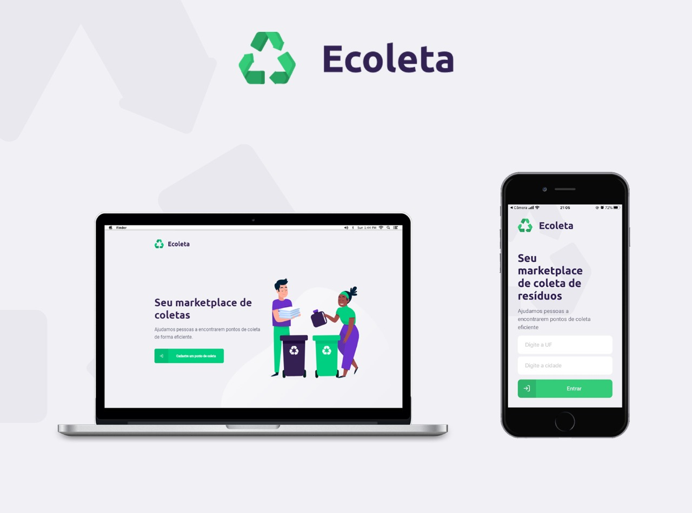

<p align="center">
  
</p>
<p align="center">Rocketseat - Nexet Level Week 1.0</p>

## Sobre

Aplicação desenvolvida com o intuito de ajudar na coleta de resíduos.

## Tecnologias utilizadas

- [ReactJS](https://pt-br.reactjs.org/)
- [React Native](https://reactnative.dev/)
- [Expo](https://expo.io/)
- [Typescript](https://www.typescriptlang.org/)
- [NodeJS](https://nodejs.org/en/)
- [Knex](http://knexjs.org/)
- [SQlite](https://www.sqlite.org/index.html)

## Execução

_Tenha instalado em sua maquina o [Git](http://git-scm.com/) e [Node.js](http://nodejs.org/) 10.0.0 (ou superior). Caso prefira, instale o [Yarn](https://yarnpkg.com/)._

1. Fork este repositório e crie um novo branch — ou crie um novo branch caso tenha permissão.

2. Depois de obter sua cópia local, acesse cada pasta que tem na raiz da aplicação (backend, frontend e app) e instale suas dependências:

```sh
npm install
```

ou

```sh
yarn
```

3. Acesse diretório _backend_ e execute o comando abaixo para criar o banco de dados:

```sh
npm run knex:migration
npm run knex:seed
```

ou

```sh
yarn knex:migration
yarn knex:seed
```

4. Acesse o diretório `backend` e execute o comando abaixo para executar o backend:

```sh
npm run dev
```

ou

```sh
yarn dev
```

5. Acesse o diretório `front` e execute o comando abaixo para executar a aplicação web:

```sh
npm start
```

ou

```sh
yarn start
```

6. Acesse o diretório `app` e execute o comando abaixo para executar a aplicação mobile:

```sh
npm start
```

ou

```sh
yarn start
```

## Licença

[MIT](https://opensource.org/licenses/MIT)
